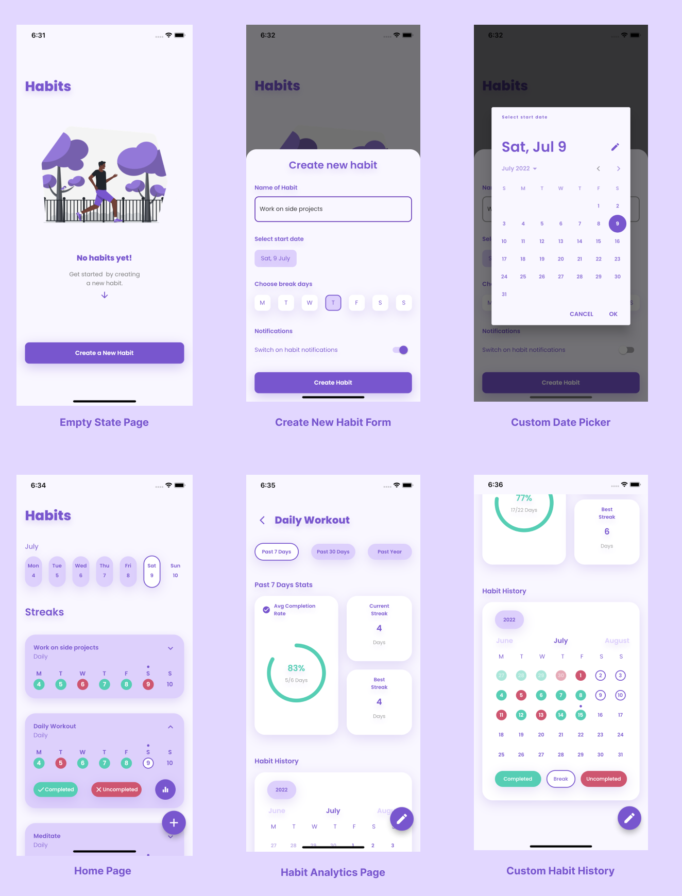

# Habit Tracker
## A Simple Habit Tracking Cross-Platform App

This application includes...
- a Homepage
- a Analytics Page
- a Empty State Page
- a Habit Statistics & Data Analytics
- a Habit Editing & Creation Bottom Sheet
- and other UI pages and elements.

## Demo of Habit Tracker UI
 

This application is yet to be fully completed.

## Requirements
* Any Operating System (ie. MacOS X, Linux, Windows)
* Any IDE with Flutter SDK installed (ie.  Android Studio, VSCode, IntelliJ, etc)
* Knowledge of Dart and Flutter

If this Repo is useful to you kindly give a star. thanks :)

Designed by yours truly with Figma.
Coded by yours truly with Flutter.
